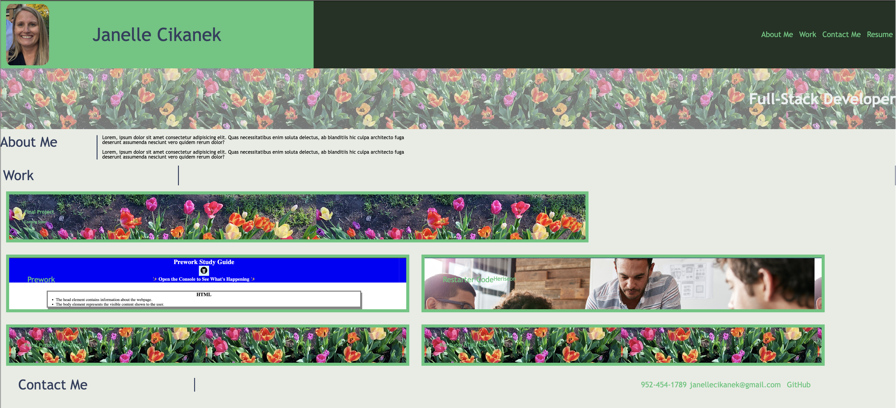

# Professional-Portfolio

## Description
This professional portfolio allows perspective employers an opportunity to view a deployed portfolio of work samples. The ability to review samples of the work will allow employers to assess whether they're a good canidate for an open position. 

The motivation to create this professional portfolio was to give potenial employers one location where they may view multiple work samples.

The goal after creating this professional portfolio is to increase the number of employers considering this canidate and to provide an easy to use format to  demonstrate skills. This portfoloo will help set this canidate apart from other applicants.

Creating this profession portfolio helped me learn Flex-box. I was able to gain a deeper understanding of Flex-box properties due to making this portfolio.

## Installation

N/A

## Usage

View the professional portfolio to view multiple work samples created by the canidate.
    

## License

Please refer to the LICENSE in the repo.
---

